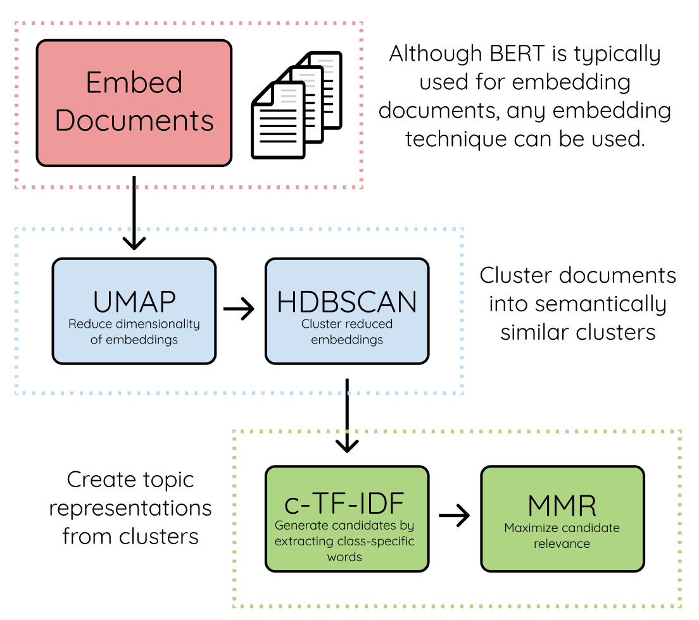

# BERTopic

BERTopic is a modeling technique that creates interpretable topics. The cuML package in [RAPIDS](https://rapids.ai/) accelerates the UMAP and DBSCAN steps of the BERTopic algorithm, resulting in significant performance gains:

### Notebooks

This repos contains notebooks for getting started with BERTopic with RAPIDS. To reproduce, we recommend using the [PyTorch container from NGC](https://catalog.ngc.nvidia.com/orgs/nvidia/containers/pytorch).

### Benchmarks

Contains benchmarks for BERTopic with RAPIDS compared to CPU.

### References

* [Getting Started](https://maartengr.github.io/BERTopic/getting_started/quickstart/quickstart.html)
* [Can I use GPU to speed up the model?](https://maartengr.github.io/BERTopic/faq.html)
